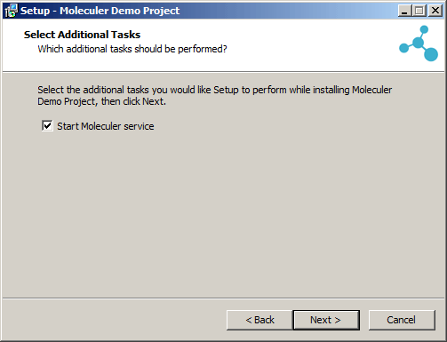

# Moleculer Java Demo Project

The project demonstrates a possible design of a functioning Moleculer-based web-application.
The application is launched and configured by the SpringBoot Framework.
The project can be easily imported into the Eclipse IDE.

The project also includes a "buildInstaller" Gradle command to create a **Windows Installer** from the project,
and it will install the finished application as a 64-bit **Windows Service**.

The Windows Service creates a Moleculer Node that can be connected to another **Java or Node.js-based** Moleculer Node.

### Download and run ###

1.) To run this Moleculer Application you need to download and install

- [Java JDK (8 or higher)](https://www.oracle.com/technetwork/java/javase/downloads/jdk8-downloads-2133151.html)
- [Eclipse IDE for Java Developers](https://www.eclipse.org/downloads/packages/)
- [Buildship Gradle Integration (Eclipse plug-in)](https://marketplace.eclipse.org/content/buildship-gradle-integration)
- [Git Integration for Eclipse (Eclipse plug-in)](https://marketplace.eclipse.org/content/egit-git-integration-eclipse)

2.) Copy this URL: https://github.com/moleculer-java/moleculer-spring-boot-demo.git

3.) Open the "Git" perspective in Eclipse. Press "CTRL+V" to paste repository URL into the "Git Repositories" area.

4.) Download the project from the repository. Left click on project, then click on the "Gradle/Refresh Gradle Project" option.

5.) Left click on "molleculer-demo.launch" file, and press on the "Run As/moleculer-demo" option.

**Build Web Application WAR**

To create a WAR for J2EE servers, run the "gradle war" command in the project's root directory.
The generated WAR is compatible with the following Application Servers:

- Oracle WebLogic Server V12
- Red Hat JBoss Enterprise Application Platform V7
- WebSphere Application Server V19 Liberty
- GlassFish Server Open Source Edition V4 and V5
- Apache Tomcat V7, V8 and V9
- Eclipse Jetty V9
- Payara Server V5

The WAR may work with other servers (it's built on standard non-blocking Servlet API).

**Build Windows Installer**

The standalone version is not Servlet-based and relies on Netty for higher performance.
The project does not include any transporter libraries (JARs) in its initial state.
If you want to use transporters (such as Redis, Kafka or NATS) the transporter dependencies must be listed in the "build.gradle" file.
To create the installer, run the "gradle buildInstaller" command in the project's root directory:


The executable installer will be generated into the "installer/dist" directory, as "moleculer_setup_1.0.0.exe".
This installer will create all required libraries and configuration files, what is needed to run the service.




The Moleculer service can be found in the list of the Windows Services:


**Make your own service**

Copy the following code snippet into the "my.services" package/folder:

```java
package my.services;

import org.springframework.stereotype.Controller;

import io.datatree.Tree;
import services.moleculer.eventbus.Listener;
import services.moleculer.eventbus.Subscribe;
import services.moleculer.service.Action;
import services.moleculer.service.Name;
import services.moleculer.service.Service;

@Name("myService")
@Controller
public class MyService extends Service {

	// --- CALLABLE ACTION ---

	@Name("myAction")
	public Action action = ctx -> {

		// Read request
		String var1 = ctx.params.get("var1", "defaultValue");
		long var2 = ctx.params.get("var2", 0L);

		// Create response
		Tree rsp = new Tree();
		rsp.put("key", "value");
		return rsp;
	};

	// --- EVENT LISTENER ---

	@Subscribe("myEvent")
	public Listener myEventListener = ctx -> {

		// Process event's payload
		boolean var3 = ctx.params.get("key", false);
	};

}
```

The "ctx.params" and "rsp" variables are hierarchical [Tree structures](https://berkesa.github.io/datatree/) (~= JSONs).
For more information about using "Tree", see the JavaDoc of Tree.
At boot time the Spring Framework will automatically register this service as a distributed Moleculer Service,
which can be called by other (Java or Node.js) nodes.

# License
Moleculer implementations are available under the [MIT license](https://tldrlegal.com/license/mit-license).
