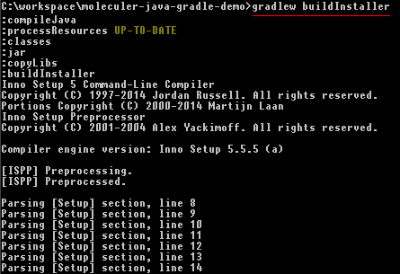
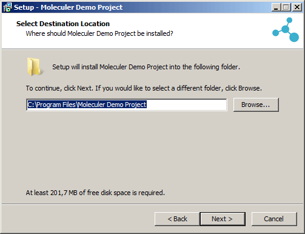
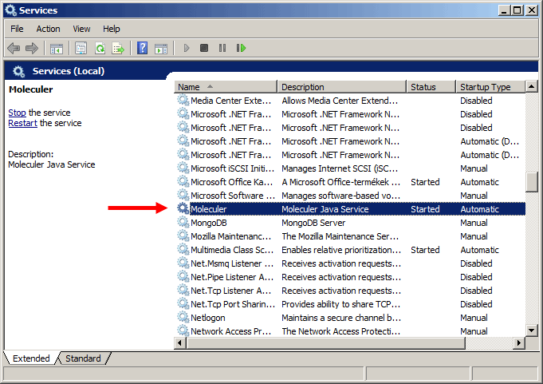

# Moleculer Java demo project for SpringBoot Framework

The project demonstrates a possible design of a functioning Moleculer-based web-application. The application is launched and configured by the SpringBoot Framework. The project can be easily imported into the Eclipse IDE.

The project also includes a "buildInstaller" Gradle command to create a **Windows Installer** from the project, and it will install the finished application as a 64-bit **Windows Service**.

The Windows Service creates a Moleculer Node that can be connected to another **Java or Node.js-based** Moleculer Node.

**Build Windows Installer**

The project does not include any transporter libraries (JARs) in its initial state. If you want to use transporters (such as Redis, Kafka or NATS) the transporter dependencies must be listed in the "build.gradle" file. For example, to use NATS, remove comment prefix from the line of the NATS dependency.


To create the installer, run the "gradlew buildInstaller" command in the project's root directory:



The executable installer will be generated into the "installer/dist" directory, as "moleculer_setup_1.0.0.exe". This installer will create all required libraries and configuration files, what is needed to run the service.





The Moleculer service can be found in the list of the Windows Services:



If you start a Node.js-based Moleculer node, you can use the REPL console to test any callable actions in the installed node:


The java-based Moleculer node's REPL console can be accessed via telnet. To do this, type "telnet localhost 21" command, then enter the user name and password (defaults are "admin" / "admin"):


**Make your own service**

Copy the following code snippet into the "my.services" package/folder:

```java
package my.services;

import org.springframework.stereotype.Controller;

import io.datatree.Tree;
import services.moleculer.eventbus.Listener;
import services.moleculer.eventbus.Subscribe;
import services.moleculer.service.Action;
import services.moleculer.service.Name;
import services.moleculer.service.Service;

@Name("myService")
@Controller
public class MyService extends Service {

	// --- CALLABLE ACTION ---

	@Name("myAction")
	public Action action = ctx -> {

		// Read request
		String var1 = ctx.params.get("var1", "defaultValue");
		long var2 = ctx.params.get("var2", 0L);

		// Create response
		Tree rsp = new Tree();
		rsp.put("key", "value");
		return rsp;
	};

	// --- EVENT LISTENER ---

	@Subscribe("myEvent")
	public Listener myEventListener = data -> {

		// Process event's payload
		boolean var3 = data.get("key", false);
	};

}
```

The "ctx.params", "rsp" and "data" variables are hierarchical [Tree structures](https://berkesa.github.io/datatree/) (~= JSONs). For more information about using "Tree", see the JavaDoc of Tree. At boot time the Spring Framework will automatically register this service as a distributed Moleculer Service, which can be called by other (Java or Node.js) nodes.

# License
Moleculer-java is available under the [MIT license](https://tldrlegal.com/license/mit-license).
